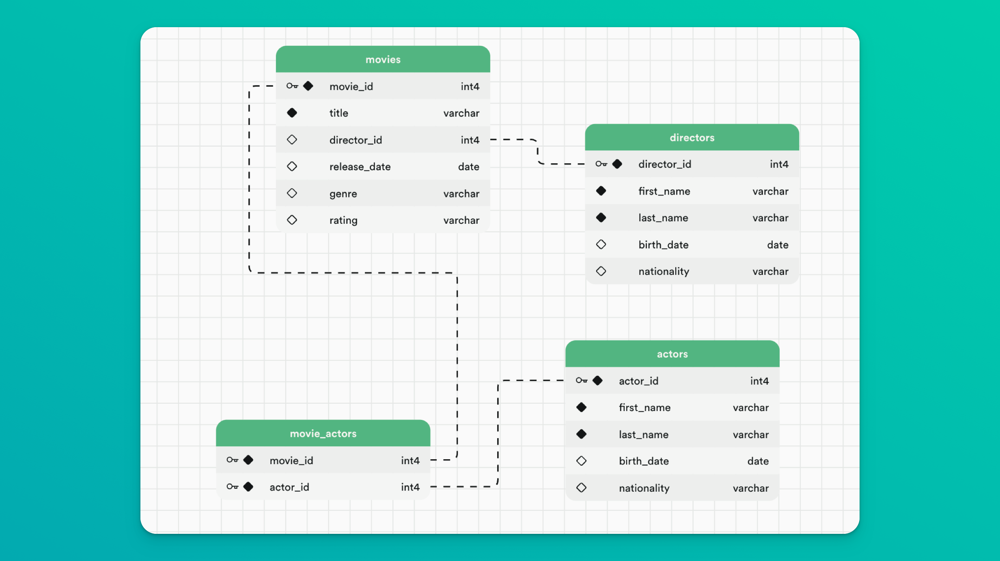
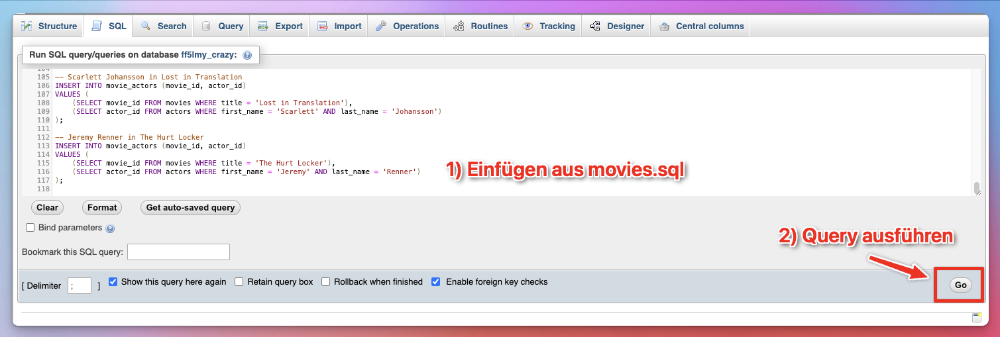

# App-Wegbereiter

Wegbereiter ist eine Webanwendung, die Menschen dabei unterstützt, wichtige persönliche Informationen, Dokumente und Verantwortlichkeiten digital zu strukturieren und weiterzugeben – z. B. für die Nachlassplanung oder zur Unterstützung nahestehender Personen.

## Funktionen

- Benutzerregistrierung und Login (mit Sessions und Passwortverschlüsselung)
- Persönliches Profil (Vorname, Adresse, AHV-Nummer, Vertrauensperson etc.)
- Kategorienübersicht (z. B. Finanzen, Gesundheit, Wohnen etc.)
- Accordion-Checklisten pro Kategorie (mit Checkbox und Dokumenten-Upload)
- Dateien hoch- und herunterladen, zentral gespeichert im Serververzeichnis
- Verwaltung von Aufgaben: is_checked Status direkt in der Datenbank gespeichert
- Rollenverwaltung: Admin kann Benutzer für Rucksackzugriff bestätigen
- Responsives Design für Desktop, Tablet und Mobile
- Datenschutzgerechte Umsetzung (keine externen Tracker, Sessions, Rechteprüfung)

## Technologien

- HTML, CSS, JavaScript (Vanilla)
- PHP (mit PDO für sichere Datenbankabfragen)
- MySQL (Datenbankstruktur im ERM-Modell)
- Visual Studio Code + Five Server / PHP-Built-in Server
- Optionaler Einsatz von Figma für UI-Prototyping

## Projektstruktur

## Datenbankmodell (Auszug)

- `users` – Login-Informationen (username, email, password)
- `user_profiles` – persönliche Infos (Vorname, Adresse etc.)
- `tasks` – Checklistenpunkte (pro Kategorie)
- `documents` – Uploads pro Aufgabe
- `backpacks` – Struktur pro Nutzer
- `backpack_access` – Zugriff und Rollenverwaltung

## Installation (lokal)

1. Projekt in lokalen Serverordner legen (z. B. XAMPP htdocs oder php -S starten)
2. Datenbank importieren (z. B. über phpMyAdmin):  
   → Datei: `a42r14_im4.sql`
3. In `system/config.php` DB-Verbindung einrichten
4. Projekt starten:  
   `http://localhost/weg-bereiter/index.html`

## Admin-Zugriff

- Registrierung über register.html
- Adminrechte können über die Datenbank manuell gesetzt werden (`backpack_access.isAdmin = 1`)

## ToDos

- Validierung bei Dateiuploads (Typen/Größe)
- E-Mail-Bestätigung beim Login (optional)
- Mehrsprachigkeit (z. B. Deutsch / Französisch)

## Geplante ToDos für die Zukunft

---

## Persönliche Reflexion

Dieses Projekt war wie so oft in diesem Fach eine emotionale Achterfahrt. Es gab sehr frustrierende Momente, aber auch glückliche und stolze Momente, wenn man einen kleinen Erfolg feiern konnte, weil etwas nach langem Probieren endlich funktioniert hat. Es mir geholfen, die verschiedenen Teile einer dynamischen Webanwendung in der Praxis zumindest ein bisschen zu verstehen: Wie Frontend, Backend und Datenbank miteinander kommunizieren, wie wichtig Datenvalidierung und Sicherheit (z. B. durch PDO) sind, und wie sich Benutzerführung durch gute Struktur und Design verbessern lässt. Das Verständnis reicht nicht dafür, dass ich es komplett alleine machen könnte, aber es reicht aus, um die richtigen Fragen zu stellen oder Profi-Entwicklern sagen zu können, was ich wollen würde.
Ich habe gelernt, sauber mit Git und Projektstruktur zu arbeiten, und habe besonders durch die Arbeit mit fetch(), Sessions und responsivem CSS mein Verständnis für moderne Webentwicklung vertieft.

Am Anfang war es herausfordernd, alle Zustände (z. B. ob ein Task gecheckt ist, oder ob ein Benutzerprofil schon existiert) korrekt abzubilden. Durch gezielte Debugging-Tools (Developer Tools, PHP-Fehleranzeigen, Konsolen-Logging) habe ich gelernt, systematisch zu testen und Probleme zu beheben.

Ich bin stolz darauf, dass wir viele unserer Herausforderungen meistern konnten (mit Unterstützung) und das gelernte Wissen aus den letzten Semestern wieder auffrischen konnten, da diese bei mir zumindest schon wieder etwas in den Hintergrund meines Gedächtnis gerutscht sind.

---

## 👥 Autor

- Name: [Dein Name hier]  
- Klasse: IM4  
- Projektzeitraum: Frühling 2025

# Supabase SQL Übungen

In diesem Dokument findest du Übungen, um SQL-Operationen (Read, Insert, Update, Delete) zu verstehen und zu üben. Der SQL-Code wird direkt im SQL-Editor in phpmyadmin geschrieben und nicht in einem PHP bzw. JavaScript-File.

## Datenbankschema

Die Übungen basieren auf einer (kleinen) Film-Datenbank mit Tabellen für Filme, Regisseure, Schauspieler und einer Relationstabelle für Filme und Schauspieler.

- `movies`: Enthält Filmdetails, wobei jeder Film einem Regisseur zugeordnet ist.
- `directors`: Enthält Details zu Filmregisseuren.
- `actors`: Enthält Details zu Filmschauspielenden.
- `movie_actors`: Eine Relationstabelle, die eine many-to-many-Beziehung zwischen Filmen und Schauspielern herstellt.

## Datenbank Importieren

Falls noch nicht geschehen, importiere die [Film-Datenbank](movies.sql) in deine Datenbank auf phpmyadmin. Kopiere dafür den SQL-Code und füge diesen im `SQL-Editor` ein.

## Übungen

### Basic

#### Select

1. **Alle Filme abrufen**: Hole alle Spalten aller Filme aus der Tabelle `movies`.
2. **Nach Genre filtern**: Rufe alle Filme ab, die dem Genre "Action" gehören.

3. **Ergebnisse sortieren**: Rufe alle Regisseure ab. Ordne sie nach ihrem Geburtsdatum `birth_date` in absteigender Reihenfolge.

4. **Filme zählen**: Ermittle, wie viele Filme Quentin Tarantino gedreht hat.

#### Insert

5. **Schauspieler einfügen**: Füge Rowan Atkinson (06.01.1955, British) in die Tabelle `actors` ein.

6. **Einen neuen Film hinzufügen**: Füge den Film 'The Hateful Eight' von Quentin Tarantino zur Tabelle `movies` hinzu. (Genre: Western, Rating: R, Veröffentlichungsdatum: 25.12.2015)

#### Update

7. **Aktualisierungen**: Ändere das Genre von 'Django Unchained' auf 'Action'.

8. **Regisseur aktualisieren**: Ändere den Namen von 'Quentin Tarantino' auf 'Tentin Quarantino'.

#### Delete

9. **Schauspieler löschen**: Lösche Rowan Atkinson aus der Tabelle `actors`.

### Advanced

10. **Tabellen verknüpfen**: Rufe alle Filme zusammen mit den vollständigen Namen ihrer jeweiligen Regisseure ab.

11. **Mit Verknüpfungen filtern**: Rufe alle Filme ab, die von amerikanischen Regisseuren gedreht wurden.

12. **Datumsoperationen**: Liste alle Filme auf, die vor dem Jahr 2000 veröffentlicht wurden.

13. **LIKE Operator**: Finde alle Regisseure, deren Vorname ODER Nachname mit dem Buchstaben 'C' beginnt.

14. **Aggregation**: Ermittle, wie viele Filme jeder Regisseur gedreht hat, und ordne das Ergebnis nach der Anzahl der Filme in absteigender Reihenfolge.

15. **Case-Anweisungen**: Kategorisiere Filme anhand ihrer Veröffentlichungsdaten (vor 2010 als 'Alt', nach 2010 als 'Neu') und zähle die Anzahl in jeder Kategorie.

## Lösungen

Zu den Lösungen geht es [hier](solution.md).
